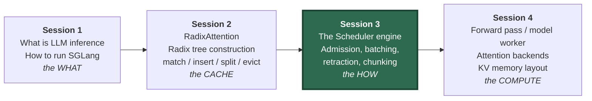
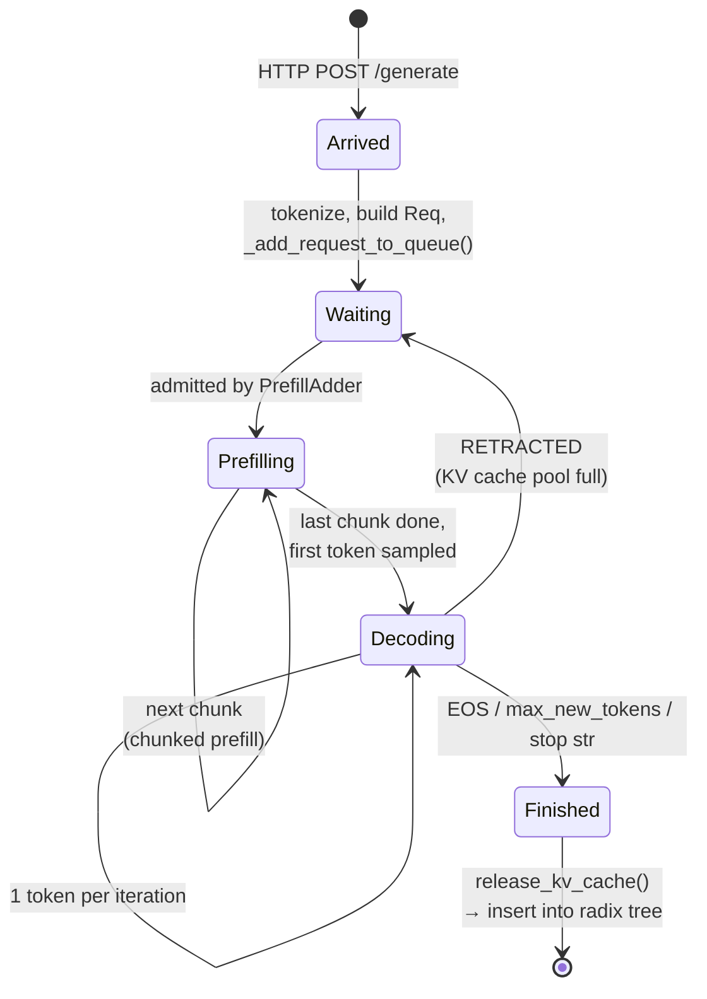
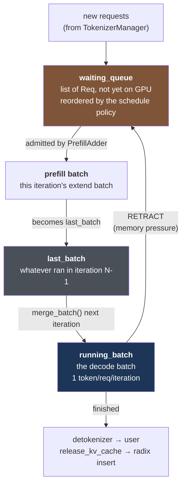
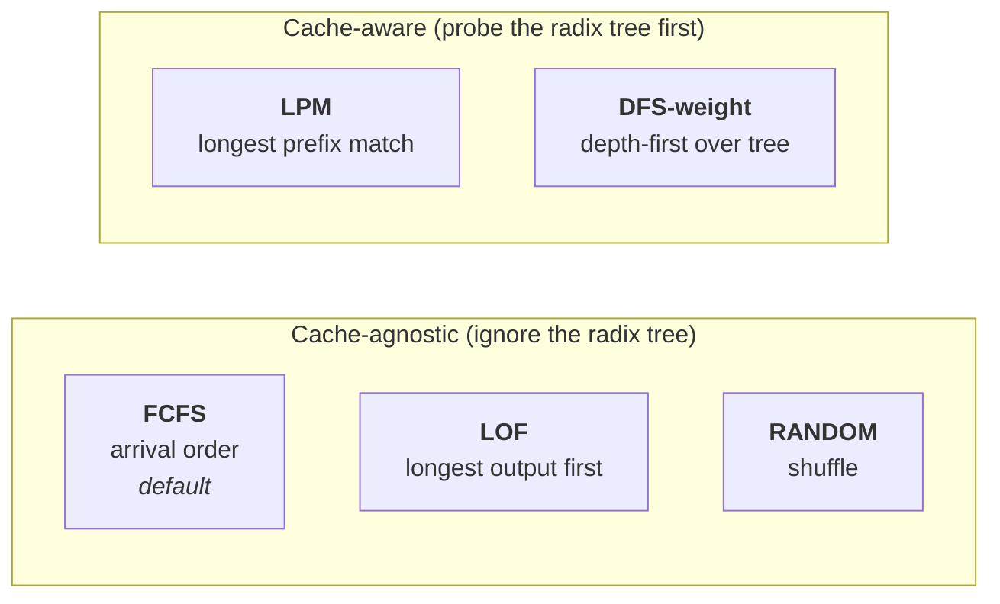
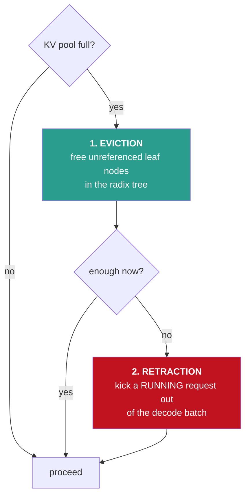
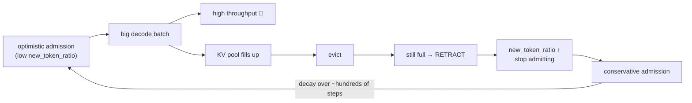
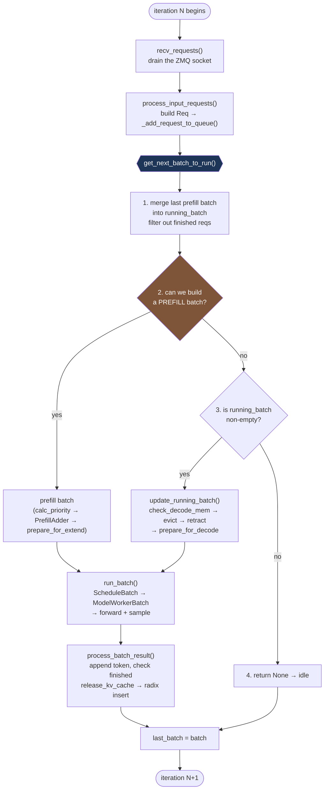

# Session 3 — Part 1: The Scheduler Engine (Theoretical Seminar)

> **How Continuous Batching Actually Runs**
> Seminar material, ~70 minutes.
> Companion to Session 2's `radix_tree_construction.md` (the cache) — this document covers
> the engine that *uses* that cache.

---

## Table of Contents & Timing

| # | Section | Time | Cumulative |
|---|---------|------|-----------|
| 0 | Where we are: recap & roadmap | 4 min | 0:04 |
| 1 | The scheduling problem in LLM serving | 14 min | 0:18 |
| 2 | Scheduling policies | 11 min | 0:29 |
| 3 | Admission control | 12 min | 0:41 |
| 4 | Memory pressure: eviction vs retraction | 12 min | 0:53 |
| 5 | Chunked prefill | 9 min | 1:02 |
| 6 | Overlap scheduling (CPU/GPU pipeline) | 8 min | 1:10 |
| 7 | Putting it together: one iteration, end to end | 4 min | 1:14 |
| 8 | Discussion questions & self-check | 6 min | 1:20 |

**Learning objectives.** By the end of Part 1 you should be able to:

1. Explain why prefill and decode have *opposite* hardware bottlenecks, and why that asymmetry is
   the root cause of every design decision in the scheduler.
2. Name the three queues the scheduler maintains and describe what moves between them.
3. Predict the admission decision for a set of requests given a token budget.
4. Distinguish **eviction** from **retraction**, and explain why one is cheap and one is expensive.
5. Explain what chunked prefill buys you and what it costs.
6. Read a `Prefill batch. ... / Decode batch. ...` log line and say what the server is doing.

---

## 0. Where We Are: Recap & Roadmap (4 min)



Session 2 answered: *"given a set of sequences, how do we avoid recomputing shared prefixes?"*
We traced `match_prefix` → `_match_prefix_helper` → `_split_node`, and `insert` → `_insert_helper`,
and we saw `inc_lock_ref` / `dec_lock_ref` protect in-flight nodes from eviction.

Session 3 answers the question that comes logically **before** all of that:

> *"Which requests are even in the batch this iteration, and who decided that?"*

Three concrete hooks back into Session 2 that we will re-open today, this time from the
scheduler's side:

| Session 2 concept | Session 3 view of it |
|---|---|
| `match_prefix()` returns `device_indices` | This is what makes a request **cheap to admit** — the scheduler's token budget only charges for the *unmatched* tail |
| `inc_lock_ref()` moves tokens from `evictable_size_` to `protected_size_` | Locking a prefix **shrinks the admission budget** — §3.4 |
| `evict()` frees leaf nodes with `lock_ref == 0` | This is the **first** response to memory pressure. Retraction is the second — §4 |

The one-sentence summary of the whole session:

> **The SGLang server is a single `while True:` loop. Every iteration it asks one question —
> "what should the GPU run next?" — and the answer is one batch. Everything else is bookkeeping.**

---

## 1. The Scheduling Problem in LLM Serving (14 min)

### 1.1 The Lifecycle of One Request



Two edges drive the rest of the session:

* **`Waiting → Prefilling` is a decision.** Something must *choose*. That something is admission
  control (§3).
* **`Decoding → Waiting` is a real edge.** A request already running on the GPU can be kicked back
  out. That is retraction (§4), and it is the part people are most surprised by.

### 1.2 Prefill and Decode Are Different Workloads

This is the single most important slide of the session.

**Prefill** processes all *P* prompt tokens at once. The matmuls are matrix–matrix (GEMM):
every weight loaded from HBM is reused across *P* tokens.

**Decode** processes exactly *1* new token per sequence. The matmuls are matrix–vector (GEMV):
you load the entire model weights from HBM to produce a single token per sequence.

Arithmetic intensity — FLOPs performed per byte moved — tells the story:

```
                 arithmetic intensity (FLOP/byte)
                 ^
     compute     |                       ####  PREFILL  (P = 2048 tokens)
     bound       |                     ##      -> hundreds of FLOP/byte
                 |                   ##        -> GPU at 60-80% of peak FLOPS
   -- ridge ---- | ---------------- ## -------------------------------------
     point       |               ##
     memory      |   #  DECODE (batch size 1)
     bound       |   #  -> ~2 FLOP/byte
                 |   #  -> GPU at ~1-3% of peak FLOPS, HBM bandwidth saturated
                 +-------------------------------------------------------->
```

Concrete numbers on one H100 (80 GB, ~3.35 TB/s HBM, ~990 TFLOPS BF16) serving a 7B model in
BF16 (~14 GB of weights):

| | Prefill, 2048 tokens | Decode, batch 1 | Decode, batch 64 |
|---|---|---|---|
| Bytes of weights read per step | ~14 GB | ~14 GB | ~14 GB |
| Useful tokens produced | 2048 | 1 | 64 |
| Bottleneck | FLOPS | HBM bandwidth | HBM bandwidth |
| Rough GPU utilization | high | terrible | decent |

**The two consequences that define the scheduler:**

1. **Decode must be batched to be efficient.** The weight read is amortized across the batch.
   Going from batch 1 → 64 costs almost nothing extra in time but produces 64× the tokens.
   *Therefore: keep the running batch as large as memory allows.*
2. **Prefill saturates the GPU by itself.** One 4K-token prefill already keeps the SMs busy.
   *Therefore: don't waste an iteration on a tiny decode when a prefill is pending.*

> ⚠️ Point 2 is exactly why **prefill has priority over decode** in `get_next_batch_to_run`.
> The scheduler always asks "can I build a prefill batch?" first, and only falls through to
> decode when the answer is no.

### 1.3 The Metrics We Are Trading Off

```
Request timeline:

  arrival        admitted        first token                       last token
     |               |                |                                 |
     v               v                v                                 v
     |---queueing----|----prefill-----|---decode---decode---...---decode-|
     |<------------ TTFT ------------>|<-ITL->|
     |<--------------------------- E2E latency ------------------------>|
```

| Metric | Definition | Who cares |
|---|---|---|
| **TTFT** (time to first token) | arrival → first token emitted | Interactive chat; a user staring at a blank box |
| **ITL / TPOT** (inter-token latency) | steady-state gap between output tokens | Perceived "typing speed"; must beat reading speed (~20–30 tok/s feels fine) |
| **Throughput** | total output tokens/s across all requests | Whoever pays the GPU bill |
| **Goodput** | throughput *counting only requests that met their SLO* | The honest metric |

**The fundamental tension:**

```
   larger batch  --->  higher throughput, higher ITL, more KV memory, more retraction risk
   smaller batch --->  lower ITL, wasted GPU, lower throughput
   prefill first --->  better GPU utilization + throughput, WORSE ITL for decoders
   decode first  --->  smooth ITL, but the queue backs up and TTFT explodes
```

There is no setting that wins on every axis. The scheduler's job is to pick a point on this
surface, and the knobs we study today (`--schedule-policy`, `--chunked-prefill-size`,
`--schedule-conservativeness`, `--max-running-requests`) are how you move along it.

> **Lab tie-in.** Session 2's 실습 3 measured exactly this curve: `concurrency` 1 → 4 → 16 → 32
> produced rising throughput and rising per-request latency. That plot *is* this trade-off. Today
> we look at the code that produces it.

### 1.4 Static Batching vs Continuous Batching (recap)

**Static batching** — form a batch, run it to completion, then form the next one:

```
req A |=P=|--d--d--d--d--d--d--d--END
req B |=P=|--d--d--END......................    <- padding / idle slot
req C |=P=|--d--d--d--d--END..................   <- padding / idle slot
req D ..................................|=P=|--d--...   <- waits for the whole batch
      ^                                  ^
      batch 1 starts                     batch 2 can finally start
```

**Continuous batching (iteration-level scheduling)** — batch membership is recomputed *every
single forward pass*:

```
iteration:   1    2    3    4    5    6    7    8    9
req A       P    d    d    d    d    END
req B       P    d    d    END
req C            P    d    d    d    d    d    END
req D                      P    d    d    d    d    d
req E                                     P    d    d
             ^         ^              ^
             |         B finishes,    D admitted into the very next
             |         its slot is    iteration after C's prefill
             |         freed mid-flight
```

Continuous batching is *not* a data structure — it is a consequence of re-running the scheduling
decision at every step. Everything in Part 2 is the machinery that makes that per-iteration
decision fast enough to be worth doing.

### 1.5 The Three Queues



| Queue | Type | Meaning |
|---|---|---|
| `waiting_queue` | `list[Req]` | Admitted to the server, not yet on the GPU. **No KV cache allocated.** |
| `running_batch` | `ScheduleBatch` | The decode batch. These requests own KV cache slots and hold radix-tree locks. |
| `last_batch` | `ScheduleBatch \| None` | What ran in the previous iteration. |

The subtlety worth stating out loud: **`last_batch` exists because the loop is pipelined in time.**
When you launch a prefill batch you don't yet know which of those requests finished immediately
(e.g. hit EOS on token 1). So you can't merge it into the decode batch until the next iteration,
after `process_batch_result` has run. `last_batch` is the one-iteration memory that makes that
possible.

---

## 2. Scheduling Policies (11 min)

The policy controls **the order of `waiting_queue`** — nothing else. It does not decide *how many*
requests are admitted (that is §3); it decides *who gets considered first*.



### 2.1 The Policies

**FCFS — First Come First Serve (default).**
Queue order = arrival order. Fair, predictable, no starvation, zero computation.
Worst-case behaviour: a 100K-token prompt at the head of the queue blocks everyone behind it
(mitigated by chunked prefill, §5).

**LPM — Longest Prefix Match (cache-aware).**
Before ordering, probe the radix tree for every waiting request — this is Session 2's
`match_prefix()`, called once per queued request — and sort by *descending matched prefix length*.
The request that can reuse the most already-computed KV goes first.

*Why it works:* prefill cost is proportional to the number of tokens you actually have to compute,
`extend_input_len = len(fill_ids) - len(prefix_indices)`. Serving the biggest cache hit first means
the cheapest requests clear the queue fastest, and it keeps the hot prefix locked
(`inc_lock_ref`, hence un-evictable) while a burst of siblings drains.

*When to use:* many requests sharing a long system prompt, few-shot template, or a multi-turn
conversation replayed from history. RAG workloads with a shared instruction block. Agent loops that
re-send a growing conversation.

*The failure mode:* **starvation.** Under sustained load, a stream of requests with a long shared
prefix will keep jumping ahead of the request whose prompt matches nothing. A cold-prefix request
can sit in the queue indefinitely.

**LOF — Longest Output First.**
Sort by descending `max_new_tokens`. Rationale: long generators should start early because they
define the makespan; starting a 2000-token generation last means the batch tail is long and the GPU
runs at low occupancy at the end. Useful for offline/batch jobs where you control `max_new_tokens`
and care about total completion time rather than per-request latency.

**RANDOM.**
Shuffle. Mostly a research/ablation baseline — it gives a fairness floor without the computation of
a real fair scheduler.

**DFS-weight.**
Order the queue by a depth-first traversal of the radix tree, weighting nodes by how many waiting
requests sit under them. Intuition: LPM is greedy per request; DFS-weight tries to finish an entire
subtree of the cache before moving on, so a hot branch is touched once and released, instead of
being re-locked repeatedly.

**Priority scheduling.**
Your branch carries an explicit per-request `priority` (visible in Session 2's material as
`TreeNode.priority` and `_set_or_validate_priority` in `_add_request_to_queue`). It affects both
queue ordering and — importantly — which requests get chosen as retraction victims (§4.3) and which
tree nodes get evicted first (`evict_policy.py` has a priority strategy).

### 2.2 A Concrete Ordering Example

Radix tree currently caches the 1000-token system prompt `SYS` (from earlier traffic).

| Req | Prompt | Matched prefix | Tokens to compute | `max_new_tokens` | Arrival |
|---|---|---|---|---|---|
| A | cold, 300 tok | 0 | 300 | 512 | t=0 |
| B | `SYS` + 40 tok | 1000 | 40 | 64 | t=1 |
| C | `SYS` + 90 tok | 1000 | 90 | 64 | t=2 |
| D | cold, 2000 tok | 0 | 2000 | 2000 | t=3 |

```
FCFS  order:  A(300)  B(40)   C(90)   D(2000)      -> 2430 tokens of compute
LPM   order:  B(40)   C(90)   A(300)  D(2000)      -> 2430 tokens, but the two
                                                       cheap cache hits finish first
LOF   order:  D(2000) A(300)  B(64)   C(64)        -> longest generator starts first
```

Discussion prompt for the room: *total* compute is identical under FCFS and LPM. So where does the
LPM win actually come from?

Answers to draw out:
- Earlier completion of cheap requests → shorter mean queueing delay.
- The hot `SYS` node is locked once instead of being evicted and rebuilt between A and D.
- B and C become decode-batch members sooner, which raises decode batch size → throughput.
- And critically (§3): admitting B and C first consumes almost no token budget, so **more requests
  fit in the same batch.** This is the effect that shows up as a hard difference in §3.5.

### 2.3 In-Batch Prefix Caching

There is a second-order effect specific to cache-aware policies. Suppose 50 identical requests
arrive at once with a prefix that is **not yet in the tree**. LPM sees prefix match = 0 for all 50,
admits all 50, and every one of them prefills the same tokens independently. The cache hit happens
*after* the batch — exactly one iteration too late.

SGLang solves this with a **second, simulated radix tree**:

```python
# schedule_policy.py:182
self.waiting_queue_radix_tree = RadixCache.create_simulated()
```

It holds no real KV — just token sequences. During `calc_priority`, each request is matched against
*both* trees: the real one (for actual cache hits) and the simulated one (for "will a sibling in
this same queue create this prefix?"). If a request's real hit is small but many queue-mates share
its prefix, it is **temporarily deprioritized** so that one sibling populates the tree first and the
rest hit it next iteration.

There is also a queue-length guard: computing prefix matches for every waiting request costs one
tree probe per request *per iteration*, so above a large queue size the policy can degrade to plain
FCFS rather than pay that cost every loop.

---

## 3. Admission Control (12 min)

### 3.1 Why You Can't Just Admit Everything

GPU memory is a fixed pie:

```
+--------------------------------------------------------------+
|  model weights (fixed)   |  activations  |     KV CACHE POOL  |
|  e.g. 14 GB for 7B bf16  |   (transient) |   everything left  |
+--------------------------------------------------------------+
                                            ^
                                            this is the resource
                                            the scheduler manages
```

The KV pool is expressed in **tokens**, not requests. One token of KV for a 7B model (32 layers,
8 KV heads with GQA, head_dim 128, BF16):

```
2 (K and V) x layers x kv_heads x head_dim x 2 bytes
= 2 x 32 x 8 x 128 x 2  =  131,072 bytes  =  128 KB per token
```

An 80 GB H100 with ~60 GB free after weights and activations holds roughly
`60 GB / 128 KB ≈ 480,000 tokens`. That sounds like a lot until you notice a single 32K-context
request with 2K of output consumes ~34K of it — about 14 concurrent long-context requests and you
are out.

**The hard part: a request's memory footprint grows as it decodes.** At admission time you know the
input length exactly; you do *not* know the output length. You only know the ceiling,
`max_new_tokens`, which is usually a wild over-estimate.

```
 tokens of KV held
   ^
   |                                   .-- max_new_tokens ceiling (rarely reached)
   |                        ..........´
   |                 ......´
   |          ......´                  <- actual, ends at EOS
   |    _____´
   |   |
   +---+-------------------------------------> time
       admission (input_len known)
```

Admit purely on `input_len` → you over-admit and hit the wall mid-decode (retraction storms).
Admit on `input_len + max_new_tokens` → absurdly conservative, tiny batches.

### 3.2 The Token Budget

Admission maintains several running budgets simultaneously. A request is admitted only if it passes
**all** of them.

| Budget | Meaning | Source |
|---|---|---|
| `rem_total_tokens` | KV pool space left, *after* reserving projected decode growth for everything already running | free pool + evictable tree − reservations |
| `rem_input_tokens` | Max prompt tokens allowed in a single prefill batch | `--max-prefill-tokens` |
| `rem_chunk_tokens` | Max tokens per chunk when chunked prefill is on | `--chunked-prefill-size` |
| running-request count | Hard cap on concurrent sequences | `--max-running-requests` |

The interesting one is the first:

```
rem_total_tokens
      = free_KV_tokens                            (allocator.available_size())
      + evictable_tokens_in_radix_tree            (tree_cache.evictable_size())
      - SUM over running requests of
            (remaining_max_new_tokens x new_token_ratio)
      - tokens already committed to this prefill batch
```

**Note what is included: `evictable_size()`.** Session 2 taught us that cached prefixes with
`lock_ref == 0` sit in `evictable_leaves` and can be freed at any time. The scheduler counts that
memory as **available** — it is willing to sacrifice future cache hits in order to admit work
*right now*. The eviction-before-retraction principle (§4) is encoded directly into this one
expression.

**Note what is excluded: `protected_size_`.** Tokens under a locked node belong to a request that is
currently using them. They are neither free nor evictable, and the budget never sees them.

### 3.3 `new_token_ratio`: The Adaptive Pessimism Dial

`new_token_ratio ∈ (0, 1]` is the fraction of each running request's *remaining* `max_new_tokens`
that the scheduler pretends it will actually use.

* `new_token_ratio = 1.0` → "assume every request generates to its full ceiling." Maximally safe,
  minimal batch size, wasted GPU.
* `new_token_ratio = 0.1` → "assume requests stop early." Big batches, high throughput, occasional
  retraction.

SGLang makes it **adaptive** with a decay-and-reset controller:

```
   new_token_ratio
      ^
 init |\                          /\                         <- reset on retraction
      | \                        /  \
      |  \                      /    \
      |   \____________________/      \___________
  min |------------------------------------------------  floor
      +--------------------------------------------------> iterations
        decays a little every                RETRACTION happened:
        decode step (optimism                jump back up (be pessimistic
        grows while nothing                  again for a while)
        goes wrong)
```

Behaviourally this is **AIMD** — the same shape as TCP congestion control: *gently get greedier
while nothing breaks; back off sharply the moment it does.*

Defaults live in `global_config.py`, scaled by `--schedule-conservativeness`: initial ratio around
`0.7`, floor around 14% of that, decaying over a few hundred steps. Raising
`--schedule-conservativeness` above 1.0 makes the server more cautious (fewer retractions, smaller
batches); lowering it makes it greedier.

### 3.4 The Lock/Budget Interaction (the subtle one)

This is the part that only makes sense *because* you did Session 2.

When a request is admitted, the scheduler must lock its matched prefix so the tree cannot evict it
mid-prefill. From Session 2's `inc_lock_ref`:

```python
if node.lock_ref == 0:
    self.evictable_size_ -= len(node.key)      # <-- budget shrinks!
    self.protected_size_ += len(node.key)
```

So **the act of admitting a request reduces `rem_total_tokens` by more than that request's own token
cost** — the newly-locked prefix leaves the evictable pool as well.

```
before admitting B (which matches a 1000-token cached prefix):
    free = 3000, evictable = 1000  ->  rem_total_tokens = 4000

after locking B's prefix and charging B's own 150 tokens:
    free = 3000, evictable = 0, protected = 1000
    rem_total_tokens = 3000 - 150 = 2850        (not 4000 - 150 = 3850)
```

Consequences:

1. The admission code must **check the budget, lock, then check again** — the second check is not
   redundant.
2. Requests sharing an *already-locked* prefix are much cheaper to admit than the first one, because
   the eviction hit was already paid. **This is why LPM naturally batches siblings together.**

### 3.5 Worked Example

Setup: KV pool has **4096** free tokens, tree has 0 evictable, nothing running,
`new_token_ratio = 0.7`, `max_prefill_tokens = 16384`, chunked prefill off.

```
waiting_queue = [ A: input 500,  max_new_tokens 256
                  B: input 2000, max_new_tokens 512 ]
```

| Step | Check | Result |
|---|---|---|
| init | `rem_total_tokens = 4096` | |
| A | needs `500 + 256 = 756`; `756 < 4096` ✓ | **admit**; `rem_total_tokens = 3340` |
| B | needs `2000 + 512 = 2512`; `2512 < 3340` ✓ | **admit**; `rem_total_tokens = 828` |
| end | budget still positive | batch = [A, B], `#new-token: 2500` |

Now change one number: the pool has only **2048** free tokens.

| Step | Check | Result |
|---|---|---|
| init | `rem_total_tokens = 2048` | |
| A | `756 < 2048` ✓ | **admit**; `rem_total_tokens = 1292` |
| B | `2512 > 1292` ✗ | **out of tokens** → mark the batch full, **stop** |
| end | | batch = [A] only; B stays in `waiting_queue` |

Third variant — same as the first, but **10 requests are already decoding**, each with 400 remaining
`max_new_tokens`:

```
reservation = 10 x 400 x 0.7 = 2800 tokens
rem_total_tokens = 4096 - 2800 = 1296
A: 756 < 1296  -> admit, rem = 540
B: 2512 > 540  -> rejected
```

Same free memory, completely different admission decision — because the scheduler is protecting the
requests already in flight.

> **This is the whole point of admission control: it is not about the new request, it is about not
> destroying the ones you already accepted.**

---

## 4. Memory Pressure: Eviction vs Retraction (12 min)

Two very different responses to "the KV pool is full", and conflating them is the most common
misunderstanding of this subsystem.



### 4.1 Eviction — Cheap, Invisible (Session 2 recap)

The radix tree holds KV for prefixes of finished requests, kept speculatively in case a future
request shares them. Each node carries `lock_ref`: > 0 means some running request is currently
reading it, and it must not be touched.

From Session 2, the two rules that matter today:

1. **Only leaf nodes are evictable.** `evictable_leaves` is maintained by `_update_leaf_status`,
   which excludes any node that is locked or that still has live children. You cannot evict a shared
   prefix out from under its branches — you evict the branches first, and the parent becomes
   evictable only once it is childless.
2. **The victim order is pluggable.** `evict_policy.py` provides LRU (default), LFU, FIFO, MRU, and
   priority strategies via `get_priority(node)`, consumed by a min-heap in `evict()`.

```
Radix tree (leaf-only, LRU-ordered eviction)

           [root]  lock_ref=1 (permanent)
              |
        "You are a helpful"          lock_ref=3   <- LOCKED, 3 running reqs; NOT a leaf anyway
         /            \
   "assistant. "     "bot. "         lock_ref=0, lock_ref=0
      /      \
 "Q: sky"  "Q: sea"                  lock_ref=0, leaves, last used 40s ago
    ^^^^      ^^^^                   <-- ONLY these are in evictable_leaves
```

Cost of an eviction: **zero recomputation for anything currently running.** You only lose a
*possible* future cache hit. That is why it is always tried first.

### 4.2 Retraction — Expensive, Last Resort

If eviction cannot free enough, the scheduler removes a request that is **actively decoding**:

```
 before                                  after retraction of req C
 ------------------------------          ------------------------------
 running_batch: [A, B, C, D]             running_batch: [A, B, D]
 C has generated 37 tokens               waiting_queue: [..., C]
 C holds 1200 + 37 tokens of KV          those 1237 tokens are FREED
```

What is preserved and what is thrown away:

| Preserved | Discarded |
|---|---|
| `origin_input_ids` (the prompt) | its KV cache blocks |
| `output_ids` generated so far (all 37 tokens) | `prefix_indices`, `last_node`, `req_pool_idx` |
| sampling params, request id | its position in the running batch |

The user-visible output is **not** lost or restarted — the request resumes generating token 38 after
re-prefill. What is lost is the *compute*: when C is admitted again, its prompt is
`origin_input_ids + output_ids` (1237 tokens) and that must be prefilled again.

**The consolation prize:** on re-prefill, C's tokens go through `match_prefix()` like any other
request. If C's original prefix is still in the tree — very likely, since eviction is LRU and C was
just using it — the match returns a large `device_indices`, and only the freshly generated tokens
need recomputing. Retraction is expensive in the worst case and nearly free in the common one.

We will watch exactly this happen in Part 2's Trace D: a 6000-token request retracts and re-enters
with `#new-token: 3`.

### 4.3 Who Gets Retracted?

The scheduler sorts the running batch and pops victims from one end. The ordering intent:

1. **Prefer requests that have generated the fewest tokens** — retracting them destroys the least
   accumulated work.
2. **Among those, prefer the ones holding the most KV** (longest input) — one victim frees more
   memory, so you need fewer victims.
3. **With priority scheduling on, low-priority requests are chosen first.**

It retracts in a loop until there is headroom for several future decode steps (not just the next
one, so you don't retract again immediately), and it **always keeps at least one request running** —
otherwise the server deadlocks, unable to make progress and unable to free anything.

### 4.4 The Feedback Loop

Retraction is also a *signal*. When it happens, the scheduler concludes that its `new_token_ratio`
estimate was too optimistic and resets it upward, so the next few hundred iterations admit more
conservatively. That is the "reset" spike in the AIMD graph in §3.3.



**Rule of thumb for operators:** occasional retraction in the log is healthy — it means you are
using your memory. Continuous retraction is thrashing: raise `--schedule-conservativeness`, lower
`--max-running-requests`, or reduce memory pressure elsewhere.

---

## 5. Chunked Prefill (9 min)

### 5.1 The Problem

A 32K-token prompt is a single enormous forward pass — on the order of a second. During that entire
time **no decode happens**, so every one of the 60 requests currently generating simply stalls.

```
without chunked prefill
-----------------------
iteration:  ...  |=========== 32K PREFILL (1.2 s) ===========|  d   d   d
decoders:   d d d |<---------- 1.2 s of nothing ------------>|  ^
                                                                 first token
                                                                 in 1.2 s
   -> one user's long prompt froze 60 other users' token streams
   -> ITL spike of >1 second: the classic head-of-line blocking of LLM serving
```

### 5.2 The Solution

Split the prefill into chunks of at most `--chunked-prefill-size` tokens, one chunk per iteration,
**mixed into the same batch as the decode tokens**:

```
with chunked prefill (chunk = 2048)
-----------------------------------
iter 1: [chunk 1/16: 2048 prefill tok] + [60 decode tok]   ~90 ms
iter 2: [chunk 2/16: 2048 prefill tok] + [60 decode tok]   ~90 ms
...
iter 16:[chunk 16/16: 1280 prefill tok] + [60 decode tok]  ~90 ms -> first token emitted
        ^                                  ^
        the long prompt still takes         but decoders keep ticking
        ~1.4 s total (slightly more)        the whole time: ITL stays ~90 ms
```

The trade:

| | Gain | Cost |
|---|---|---|
| Decoders | ITL stays bounded and smooth | slightly slower per step (batch is bigger) |
| The long prompt | doesn't monopolize the GPU | TTFT slightly worse (more launches, some KV re-reading) |
| Whole server | no latency cliffs, predictable p99 | small throughput overhead (a few %) |

This is why chunked prefill is **on by default** in modern SGLang: it converts a rare catastrophic
latency spike into a small constant tax.

### 5.3 Mixed Batches

A "mixed" batch contains both extend (prefill) and decode tokens in the same forward pass:

```
 token layout in one mixed forward batch

 |<------ prefill chunk of req X ------>|<- 1 tok ->|<- 1 tok ->|<- 1 tok ->|
 | x1 x2 x3 ... x2048                   |    A_n    |    B_n    |    C_n    |
   attention: causal within chunk +       attention: 1 query vs
   attends to X's previously cached       that request's full
   chunks                                 KV history
```

Two practical consequences:

* The attention backend must support a batch whose sequences have wildly different query lengths
  (2048 vs 1). This is why chunked prefill support is a per-backend property, and why some exotic
  backends or speculative-decoding modes disable it.
* Decode tokens in a mixed batch are *not free* — they occupy budget. Admission therefore starts the
  prefill budget already debited by the decode tokens it plans to mix in.

### 5.4 Choosing the Chunk Size

```
   small chunk (512)                       large chunk (8192)
   ------------------                      ------------------
 + very smooth ITL                       + fewer iterations, better prefill throughput
 + fast reaction to new decodes          + less per-iteration overhead
 - many iterations -> worse TTFT         - bigger ITL bumps for decoders
 - kernel launch overhead dominates      - approaches the no-chunking behaviour
```

Defaults depend on version and available memory (commonly 8192, smaller on constrained GPUs); check
`server_args.py` on your branch. `--chunked-prefill-size -1` disables chunking entirely.

**Dynamic chunking.** Rather than a fixed size, the scheduler can predict the next chunk size from
recent history — if recent iterations were fast and the decode batch is small, take a bigger bite;
if decode pressure is high, take a smaller one. Same idea as an adaptive read-ahead window.

### 5.5 The State Machine

Only one chunked request can be in flight at a time. Its lifecycle:

```mermaid
sequenceDiagram
    participant Q as waiting_queue
    participant A as PrefillAdder
    participant S as scheduler.chunked_req
    participant T as radix tree
    Q->>A: req X (32K tokens), budget only 2048
    A->>A: truncate: extend_input_len = 2048
    A->>S: set as chunked_req
    Note over S: iteration N: chunk 1 runs
    S->>T: cache_unfinished_req(X, chunked=True)<br/>insert partial KV, inc_lock_ref
    Note over S: iteration N+1: init_next_round_input()<br/>match_prefix now returns chunk 1
    S->>S: chunk 2 ... chunk 16
    Note over S: last chunk: extend_input_len fits fully
    S->>Q: chunked_req = None; X joins running_batch as a normal decoder
```

The critical detail: the intermediate KV of a partially prefilled request is inserted into the radix
tree and **locked** so it cannot be evicted between chunks. Without that lock, chunk 3 could evict
chunk 1's KV and the request would be corrupt.

Note this is a *reuse* of Session 2's machinery, not new machinery: `cache_unfinished_req` is the
same function that handles ordinary prefill completion, with `chunked=True` passed through to
`insert(InsertParams(..., chunked=chunked))`.

---

## 6. Overlap Scheduling — the CPU/GPU Pipeline (8 min)

### 6.1 The Problem: CPU Work Is Not Free

Every iteration involves real CPU work around the GPU kernel:

```
 CPU: [recv requests][build batch][launch]  ....GPU busy....  [sample][detok][send][sched]
                                             ^
                                             during all of this the CPU has nothing to do,
                                             and during the CPU phases the GPU is IDLE
```

For a large model with 100 ms forward passes, a 10 ms CPU tail costs you 10%. For a small model
where the forward pass is 8 ms, a 5 ms CPU tail costs you **38%** of your throughput.

> This is directly relevant to the lab: Session 2's 실습 used **Qwen2.5-1.5B**. At that model size
> the CPU tail is a large fraction of every iteration, which is exactly the regime where overlap
> scheduling matters most.

### 6.2 Normal Mode vs Overlap Mode

**Normal mode** — strictly serialized:

```
time ->
CPU  [sched N][launch]........................[result N][sched N+1][launch]...............
GPU  ..........[========= forward N =========].................[====== forward N+1 ======]
     |<--gap-->|                              |<---- gap ---->|
```

**Overlap mode** — a 1-batch software pipeline:

```
time ->
CPU  [sched N][launch N][process result N-1][sched N+1][launch N+1][process result N]......
GPU  ..........[========= forward N ==========][========= forward N+1 ==========].........
                          ^
                          CPU is doing batch N-1's bookkeeping while
                          the GPU chews on batch N. The GPU never waits.
```

The depth is exactly **one batch**. The scheduler launches batch N, then immediately pops batch
N−1's results off a queue and processes them.

### 6.3 The Awkward Part: You Schedule Before You Know the Results

If you build batch N+1 while batch N's sampled tokens are still on the GPU, you don't know:

* which requests hit EOS in batch N (so should be removed),
* what the sampled token IDs are (needed to build the next input).

SGLang resolves this with **future tokens**: batch N+1 is built using placeholder token slots
(negative indices into a future-token buffer) that get resolved on the GPU once batch N's sampling
completes. The CPU never blocks on `.cpu()` for the token values. Same idea as a dataflow future —
the *shape* of the work is known even when the *values* are not.

Nuance to flag: because of this, a request that finished in batch N may still be "in" batch N+1 for
one extra step; the correction happens when results are finally processed. This is the source of
small accounting details you'll see in the code (exclusion sets, `is_retracted` guards).

### 6.4 When Overlap Is Turned Off

Overlap is disabled for specific batches, most notably **consecutive prefill batches**.

Why: if batch N is a prefill and batch N+1 is also a prefill, pipelining them means the first
prefill's token is still in flight while the second launches. TTFT is measured to the token actually
being *available*, and the pipeline delays that observation by one full iteration. Since prefill
batches are long anyway (so the CPU tail is a small fraction), the throughput gain is small while
the TTFT cost is a whole iteration.

| | Normal | Overlap |
|---|---|---|
| Throughput | lower | higher (CPU hidden) |
| Code complexity | trivial | future tokens, result queue |
| Debuggability | easy — breakpoints work naturally | harder — results lag one iteration |
| Best for | debugging, huge models | production, small/medium models |

> For Part 2 we read `event_loop_normal` **first** and treat `event_loop_overlap` as "the same
> thing, shifted by one." That is genuinely the easiest way to learn it — and it is why the hands-on
> lab runs with `--disable-overlap-schedule` when setting breakpoints.

---

## 7. Putting It Together: One Iteration, End to End (4 min)



Four things to carry into Part 2:

1. **Prefill is checked before decode.** Always.
2. **The radix tree insert happens in `process_batch_result`,** after the forward pass — which is
   exactly where Session 2's call chain ended
   (`batch_result_processor.py:238 → release_kv_cache → cache_finished_req → insert`). That is the
   seam between the two sessions.
3. **`waiting_queue` is a list, not a queue.** It gets *reordered* every iteration by the policy.
4. **Memory decisions bracket every step:** admission reserves it, `check_decode_mem` verifies it,
   eviction and retraction reclaim it, `release_kv_cache` returns it.

---

## 8. Discussion Questions & Self-Check (6 min)

**Conceptual**

1. Why does prefill get priority over decode, given that prefill *hurts* decode ITL? Under what
   workload would you want to invert that rule?
2. The scheduler reserves `remaining_max_new_tokens × new_token_ratio` per running request. Which
   direction does the error go if `new_token_ratio` is too low? Too high? Which failure is worse?
3. Eviction and retraction both free KV cache. Give one scenario where eviction is impossible but
   retraction is not, and one where the reverse is true.
4. Session 2 showed that only **leaf** nodes are evictable. What does that imply for a workload where
   one long system prompt is shared by 200 active conversations? Which node can never be evicted
   while traffic continues, and is that good or bad?
5. Under LPM, construct an arrival pattern that starves a specific request forever. What is the
   simplest mitigation you'd add?
6. Chunked prefill makes TTFT slightly worse and ITL much better. Name a workload where you'd turn
   it off.
7. Overlap scheduling gives a bigger relative win on small models than on large ones. Why? Would you
   expect to measure the difference on Qwen2.5-1.5B from the Session 2 lab?

**Predict the behaviour**

8. `--max-running-requests 256` on a GPU whose KV pool holds 100K tokens, with 4K-token prompts.
   What actually limits concurrency? What will the log show?
9. You see this in the log, repeatedly, once a second:
   `KV cache pool is full. Retract requests. #retracted_reqs: 8, #new_token_ratio: 0.71`
   List three knobs you'd try, in order, and say what each one trades away.
10. A user reports "the first token takes 4 seconds but then it's fast." Which subsystem do you
    suspect, and which log field confirms it?

**Reading the logs** — decode these two lines before Part 2:

```
Prefill batch. #new-seq: 5, #new-token: 1234, #cached-token: 4096, token usage: 0.31, #running-req: 12, #queue-req: 40
Decode batch.  #running-req: 17, #token: 8931, token usage: 0.44, gen throughput (token/s): 1820, #queue-req: 40
```

* Which of the 5 new sequences were cache hits, and how much compute did the tree save?
  (These are the same `#cached-token` / `#new-token` fields you collected per-request as
  `meta_info.cached_tokens` in Session 2's 실습 1.)
* Why is `#running-req: 12` on the prefill line but `17` on the decode line?
* `#queue-req: 40` is unchanged across both. What does that tell you about the token budget?

---

## Appendix A — Glossary

| Term | Meaning |
|---|---|
| **Prefill / extend** | Processing prompt tokens; compute-bound; produces the first output token |
| **Decode** | Producing one token per sequence per iteration; memory-bandwidth-bound |
| **Iteration / step** | One forward pass = one turn of the event loop |
| **TTFT / ITL / TPOT** | Time to first token / inter-token latency / time per output token |
| **KV pool** | Preallocated GPU buffer holding all key/value tensors, measured in tokens |
| **Page** | Allocation granularity in the KV pool (`--page-size`); token counts round up to it |
| **`evictable_size_`** | Tokens in unlocked tree nodes — counted as *available* by the budget |
| **`protected_size_`** | Tokens under locked nodes (`lock_ref > 0`) — invisible to the budget |
| **Eviction** | Freeing unreferenced **leaf** nodes from the radix tree |
| **Retraction** | Removing a *running* request from the decode batch and re-queueing it |
| **Chunked prefill** | Splitting a long prompt across iterations, mixed with decode |
| **Mixed batch** | One forward pass containing both extend and decode tokens |
| **Overlap scheduling** | Running CPU bookkeeping for batch N−1 while the GPU runs batch N |
| **`new_token_ratio`** | Adaptive estimate of how much of `max_new_tokens` requests will actually use |

## Appendix B — The Knobs, and What They Move

| Flag | Effect | Raise it when | Lower it when |
|---|---|---|---|
| `--schedule-policy {fcfs,lpm,lof,random,dfs-weight}` | queue ordering | shared prefixes → `lpm` | fairness matters → `fcfs` |
| `--schedule-conservativeness` | scales `new_token_ratio` | retraction thrashing | GPU underutilized |
| `--max-running-requests` | hard concurrency cap | throughput-oriented | ITL/p99-oriented |
| `--chunked-prefill-size` | tokens per prefill chunk | prefill throughput matters | ITL spikes from long prompts |
| `--max-prefill-tokens` | tokens per prefill batch | batching many prompts | TTFT jitter |
| `--mem-fraction-static` | share of VRAM for weights + static | OOM at startup | KV pool too small |
| `--disable-overlap-schedule` | turn off the pipeline | debugging | (default on = keep it) |
| `--disable-radix-cache` | no prefix reuse | measuring cache benefit | (normally keep it on) |
| `--page-size` | KV allocation granularity | long sequences | fine-grained sharing |

## Appendix C — Further Reading

* **Orca** (OSDI '22) — introduced iteration-level (continuous) batching.
* **vLLM / PagedAttention** (SOSP '23) — paged KV allocation; the memory model chunked prefill assumes.
* **SGLang / RadixAttention** (2024) — the prefix cache from Session 2.
* **Sarathi-Serve** (OSDI '24) — chunked prefill and "stall-free batching"; the clearest analysis of
  the prefill/decode interference problem in §5.
* **DistServe** (OSDI '24) — the opposite conclusion: separate prefill and decode onto *different*
  GPUs. Good contrast material for the §1.3 discussion.
